# servlet容器运行流程

1. Servlet容器启动会扫描，当前应用里面每一个jar包的
   	**ServletContainerInitializer**的实现
2. 提供**ServletContainerInitializer**的实现类；
   	必须绑定在，==**META-INF/services/javax.servlet.ServletContainerInitializer**==
      	文件的内容就是ServletContainerInitializer实现类的全类名；


总结：容器在启动应用的时候，会扫描当前应用每一个jar包里面
META-INF/services/javax.servlet.ServletContainerInitializer
指定的实现类，启动并运行这个实现类的方法(onStartup())；**传入感兴趣的类型**；

ServletContainerInitializer；
@HandlesTypes；


servletContext可以注册tomcat三大组件:

```java
//容器启动的时候会将@HandlesTypes指定的这个类型下面的子类（实现类，子接口等）传递过来；
//传入感兴趣的类型；
@HandlesTypes(value={HelloService.class})
public class MyServletContainerInitializer implements ServletContainerInitializer {

	/**
	 * 应用启动的时候，会运行onStartup方法；
	 * 
	 * Set<Class<?>> arg0：感兴趣的类型的所有后代类型；
	 * ServletContext arg1:代表当前Web应用的ServletContext；一个Web应用一个ServletContext；
	 * 
	 * 1）、使用ServletContext注册Web组件（Servlet、Filter、Listener）
	 * 2）、使用编码的方式，在项目启动的时候给ServletContext里面添加组件；
	 * 		必须在项目启动的时候来添加；
	 * 		1）、ServletContainerInitializer得到的ServletContext；
	 * 		2）、ServletContextListener得到的ServletContext；
	 */
	@Override
	public void onStartup(Set<Class<?>> arg0, ServletContext sc) throws ServletException {
		// TODO Auto-generated method stub
		System.out.println("感兴趣的类型：");
		for (Class<?> claz : arg0) {
			System.out.println(claz);
		}
		
		//注册组件  ServletRegistration  
		ServletRegistration.Dynamic servlet = sc.addServlet("userServlet", new UserServlet());
		//配置servlet的映射信息
		servlet.addMapping("/user");
		
		
		//注册Listener
		sc.addListener(UserListener.class);
		
		//注册Filter  FilterRegistration
		FilterRegistration.Dynamic filter = sc.addFilter("userFilter", UserFilter.class);
		//配置Filter的映射信息
		filter.addMappingForUrlPatterns(EnumSet.of(DispatcherType.REQUEST), true, "/*");
		
	}

}
```

 内置tomcat已经有这个jar包了, 在项目打包的时候让它不打包这个jar包避免冲突:

```xml
<dependency>
  		<groupId>javax.servlet</groupId>
  		<artifactId>servlet-api</artifactId>
  		<version>3.0-alpha-1</version>
  		<scope>provided</scope>
  	</dependency>
```


# 注解的方式整合springMVC

1. 实现初始化器(随便实现一个), 在servlet容器启动的时候加载完spring的配置类和webMVC配置类

   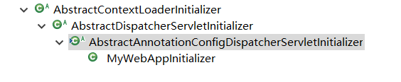

   

```java
//web容器启动的时候创建对象；调用方法来初始化容器以前前端控制器
public class MyWebAppInitializer extends AbstractAnnotationConfigDispatcherServletInitializer {

	//获取根容器的配置类；（Spring的配置文件）   父容器；
	@Override
	protected Class<?>[] getRootConfigClasses() {
		// TODO Auto-generated method stub
		return new Class<?>[]{RootConfig.class};
	}

	//获取web容器的配置类（SpringMVC配置文件）  子容器；
	@Override
	protected Class<?>[] getServletConfigClasses() {
		// TODO Auto-generated method stub
		return new Class<?>[]{AppConfig.class};
	}

	//获取DispatcherServlet的映射信息
	//  /：拦截所有请求, 较给springMVC处理（包括静态资源（xx.js,xx.png）），但是不包括*.jsp；
	//  /*：拦截所有请求；连*.jsp页面都拦截；jsp页面是tomcat的jsp引擎解析的；
	@Override
	protected String[] getServletMappings() {
		// TODO Auto-generated method stub
		return new String[]{"/"};
	}

}

```


webMVC配置类:

```java
//SpringMVC只扫描Controller；子容器
//useDefaultFilters=false 禁用默认的过滤规则；
@ComponentScan(value="com.atguigu",includeFilters={
		@Filter(type=FilterType.ANNOTATION,classes={Controller.class})
},useDefaultFilters=false)
@EnableWebMvc
public class AppConfig  extends WebMvcConfigurerAdapter  {

	//定制
	
	//视图解析器
	@Override
	public void configureViewResolvers(ViewResolverRegistry registry) {
		// TODO Auto-generated method stub
		//默认所有的页面都从 /WEB-INF/ xxx .jsp
		//registry.jsp();
		registry.jsp("/WEB-INF/views/", ".jsp");
	}
	
	//静态资源访问
	@Override
	public void configureDefaultServletHandling(DefaultServletHandlerConfigurer configurer) {
		// TODO Auto-generated method stub
		configurer.enable();
	}
	
	//拦截器
	@Override
	public void addInterceptors(InterceptorRegistry registry) {
		// TODO Auto-generated method stub
		//super.addInterceptors(registry);
		registry.addInterceptor(new MyFirstInterceptor()).addPathPatterns("/**");
	}

}

```


spring配置类:

```java
//Spring的容器不扫描controller;父容器
@ComponentScan(value="com.atguigu",excludeFilters={
		@Filter(type=FilterType.ANNOTATION,classes={Controller.class})
})
public class RootConfig {

}
```

---


#  springMVC的定制

1. @EnableWebMvc:开启SpringMVC定制配置功能；
   	<mvc:annotation-driven/>；

2. 配置组件（视图解析器、视图映射、静态资源映射、拦截器。。。）
   	extends WebMvcConfigurerAdapter(或其实现类)

   ```java
    * Copyright 2002-2016 the original author or authors.
   
   package org.springframework.web.servlet.config.annotation;
   
   import java.util.List;
   
   import org.springframework.format.FormatterRegistry;
   import org.springframework.http.converter.HttpMessageConverter;
   import org.springframework.validation.MessageCodesResolver;
   import org.springframework.validation.Validator;
   import org.springframework.web.method.support.HandlerMethodArgumentResolver;
   import org.springframework.web.method.support.HandlerMethodReturnValueHandler;
   import org.springframework.web.servlet.HandlerExceptionResolver;
   
   /**
    * An implementation of {@link WebMvcConfigurer} with empty methods allowing
    * subclasses to override only the methods they're interested in.
    *
    * @author Rossen Stoyanchev
    * @since 3.1
    */
   public abstract class WebMvcConfigurerAdapter implements WebMvcConfigurer {
   
   	/**
   	 * {@inheritDoc}
   	 * <p>This implementation is empty.
   	 */
   	@Override
   	public void configurePathMatch(PathMatchConfigurer configurer) {
   	}
   
   	/**
   	 * {@inheritDoc}
   	 * <p>This implementation is empty.
   	 */
   	@Override
   	public void configureContentNegotiation(ContentNegotiationConfigurer configurer) {
   	}
   
   	/**
   	 * {@inheritDoc}
   	 * <p>This implementation is empty.
   	 */
   	@Override
   	public void configureAsyncSupport(AsyncSupportConfigurer configurer) {
   	}
   
   	/**
   	 * {@inheritDoc}
   	 * <p>This implementation is empty.
   	 */
   	@Override
   	public void configureDefaultServletHandling(DefaultServletHandlerConfigurer configurer) {
   	}
   
   	/**
   	 * {@inheritDoc}
   	 * <p>This implementation is empty.
   	 */
   	@Override
   	public void addFormatters(FormatterRegistry registry) {
   	}
   
   	/**
   	 * {@inheritDoc}
   	 * <p>This implementation is empty.
   	 */
   	@Override
   	public void addInterceptors(InterceptorRegistry registry) {
   	}
   
   	/**
   	 * {@inheritDoc}
   	 * <p>This implementation is empty.
   	 */
   	@Override
   	public void addResourceHandlers(ResourceHandlerRegistry registry) {
   	}
   
   	/**
   	 * {@inheritDoc}
   	 * <p>This implementation is empty.
   	 */
   	@Override
   	public void addCorsMappings(CorsRegistry registry) {
   	}
   
   	/**
   	 * {@inheritDoc}
   	 * <p>This implementation is empty.
   	 */
   	@Override
   	public void addViewControllers(ViewControllerRegistry registry) {
   	}
   
   	/**
   	 * {@inheritDoc}
   	 * <p>This implementation is empty.
   	 */
   	@Override
   	public void configureViewResolvers(ViewResolverRegistry registry) {
   	}
   
   	/**
   	 * {@inheritDoc}
   	 * <p>This implementation is empty.
   	 */
   	@Override
   	public void addArgumentResolvers(List<HandlerMethodArgumentResolver> argumentResolvers) {
   	}
   
   	/**
   	 * {@inheritDoc}
   	 * <p>This implementation is empty.
   	 */
   	@Override
   	public void addReturnValueHandlers(List<HandlerMethodReturnValueHandler> returnValueHandlers) {
   	}
   
   	/**
   	 * {@inheritDoc}
   	 * <p>This implementation is empty.
   	 */
   	@Override
   	public void configureMessageConverters(List<HttpMessageConverter<?>> converters) {
   	}
   
   	/**
   	 * {@inheritDoc}
   	 * <p>This implementation is empty.
   	 */
   	@Override
   	public void extendMessageConverters(List<HttpMessageConverter<?>> converters) {
   	}
   
   	/**
   	 * {@inheritDoc}
   	 * <p>This implementation is empty.
   	 */
   	@Override
   	public void configureHandlerExceptionResolvers(List<HandlerExceptionResolver> exceptionResolvers) {
   	}
   
   	/**
   	 * {@inheritDoc}
   	 * <p>This implementation is empty.
   	 */
   	@Override
   	public void extendHandlerExceptionResolvers(List<HandlerExceptionResolver> exceptionResolvers) {
   	}
   
   	/**
   	 * {@inheritDoc}
   	 * <p>This implementation returns {@code null}.
   	 */
   	@Override
   	public Validator getValidator() {
   		return null;
   	}
   
   	/**
   	 * {@inheritDoc}
   	 * <p>This implementation returns {@code null}.
   	 */
   	@Override
   	public MessageCodesResolver getMessageCodesResolver() {
   		return null;
   	}
   
   }
   
   ```

   ---

   

   # Servlet异步请求

   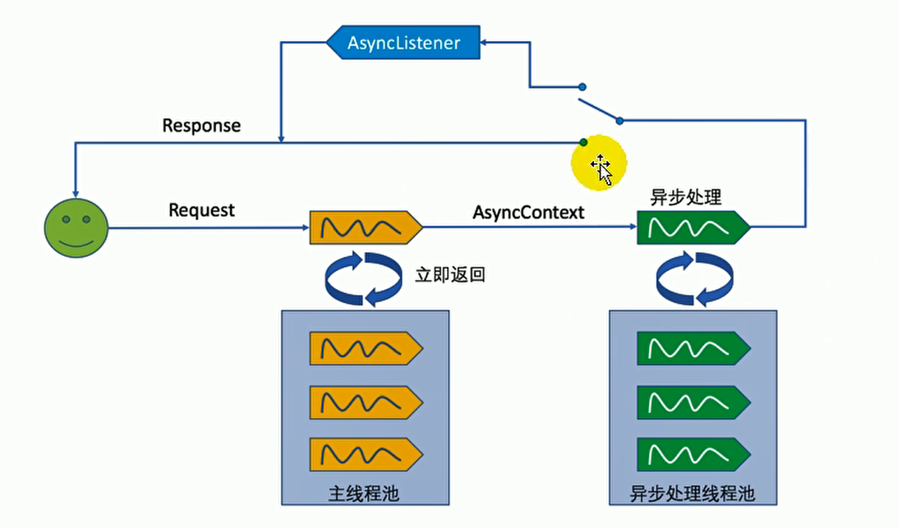

   1. 要支持异步的Servlet, 在Servlet进行映射的时候就要使Servlet支持异步==(**asyncSupported**):==

   ```java
   @WebServlet(value="/async",asyncSupported=true)
   public class HelloAsyncServlet extends HttpServlet {
   ```

   2. 开启异步模式:  

      **AsyncContext startAsync = req.startAsync();**   

      **//3、业务逻辑进行异步处理;开始异步处理**

      **startAsync.start(new Runnable() {**

      **@Override**
      			**public void run() {**
      				**try {**

      ​				==startAsync.complete();==

      ​              	//获取到异步上下文

      ​					AsyncContext asyncContext = req.getAsyncContext();

      ​					//4、获取响应

      ​					==ServletResponse response = asyncContext.getResponse();==

      ​					response.getWriter().write("hello async...");

      ​					**}**

      ​			**}**

      **}**

      ```java
      @Override
      	protected void doGet(HttpServletRequest req, HttpServletResponse resp) throws ServletException, IOException {
      		//1、支持异步处理asyncSupported=true
      		//2、开启异步模式
      		System.out.println("主线程开始。。。"+Thread.currentThread()+"==>"+System.currentTimeMillis());
      		AsyncContext startAsync = req.startAsync();
      		
      		//3、业务逻辑进行异步处理;开始异步处理
      		startAsync.start(new Runnable() {
      			@Override
      			public void run() {
      				try {
      					System.out.println("副线程开始。。。"+Thread.currentThread()+"==>"+System.currentTimeMillis());
      					sayHello();
      					startAsync.complete();
      					//获取到异步上下文
      					AsyncContext asyncContext = req.getAsyncContext();
      					//4、获取响应
      					ServletResponse response = asyncContext.getResponse();
      					response.getWriter().write("hello async...");
      					System.out.println("副线程结束。。。"+Thread.currentThread()+"==>"+System.currentTimeMillis());
      				} catch (Exception e) {
      				}
      			}
      		});		
      		System.out.println("主线程结束。。。"+Thread.currentThread()+"==>"+System.currentTimeMillis());
      ```


# SpringMVC使用异步线程池

Controller返回值写成==**Callable**==类型或者==**DeferredResult**==类型

## 方式一:  Callable

```java
@ResponseBody
	@RequestMapping("/async01")
	public Callable<String> async01(){
        
		Callable<String> callable = new Callable<String>() {
			@Override
			public String call() throws Exception {
				Thread.sleep(2000);
				return "Callable<String> async01()";
			}
		};
		return callable;
	}
```

工作流程:

```java
/**
	 * 1、控制器返回Callable
	 * 2、Spring异步处理，将Callable 提交到 TaskExecutor 使用一个隔离的线程进行执行
	 * 3、DispatcherServlet和所有的Filter退出web容器的线程，但是response 保持打开状态；
	 * 4、Callable返回结果，SpringMVC将请求重新派发给容器，恢复之前的处理；
	 * 5、根据Callable返回的结果。SpringMVC继续进行视图渲染流程等（从收请求-视图渲染）。
	 * 
	 * preHandle.../springmvc-annotation/async01
		主线程开始...Thread[http-bio-8081-exec-3,5,main]==>1513932494700
		主线程结束...Thread[http-bio-8081-exec-3,5,main]==>1513932494700
		=========DispatcherServlet及所有的Filter退出线程============================
		
		================等待Callable执行==========
		副线程开始...Thread[MvcAsync1,5,main]==>1513932494707
		副线程开始...Thread[MvcAsync1,5,main]==>1513932496708
		================Callable执行完成==========
		
		================再次收到之前重发过来的请求========
		preHandle.../springmvc-annotation/async01
		postHandle...（Callable的之前的返回值就是目标方法的返回值）
		afterCompletion...
		
**/
```


## 方式二: DeferredResult

应用场景:

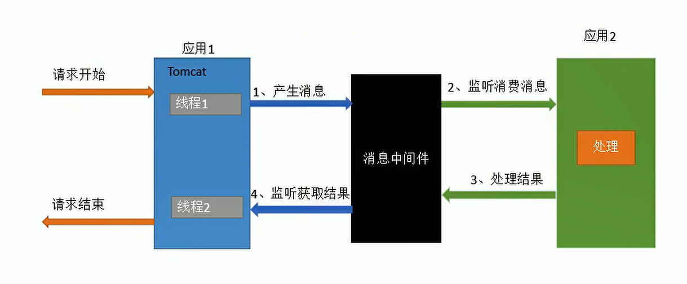

要给DeferredResult对象==**设置result**==才会结束业务线程, controller才会得到响应, ==**设置的对象就是controller的返回结果**==:

```java
@ResponseBody
	@RequestMapping("/createOrder")
	public DeferredResult<Object> createOrder(){
        //deferredResult消息中间件的模拟
		DeferredResult<Object> deferredResult = new DeferredResult<>((long)3000, "create fail...");
			//一般情况下其他模块会使用deferredResult对象来设置result, 消息中间件一收到消息就会通知controller继续执行
			deferredResult.setResult('订单号');
		
		return deferredResult;
	}
```


# 缓存

**概念**:

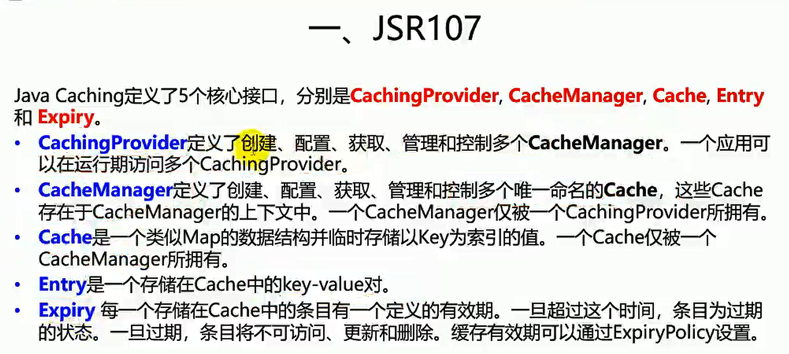


**原理**:

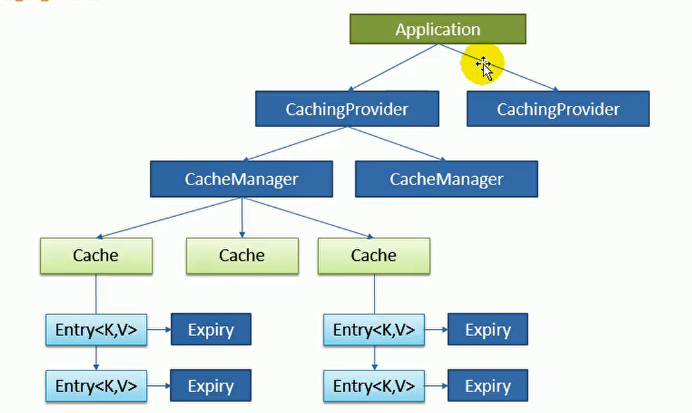


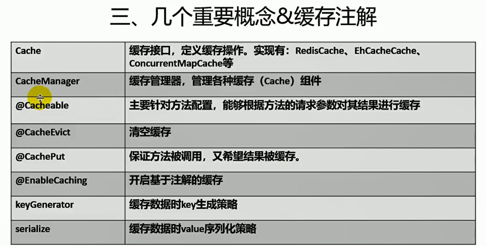


**缓存注解支持使用的spel表达式:**

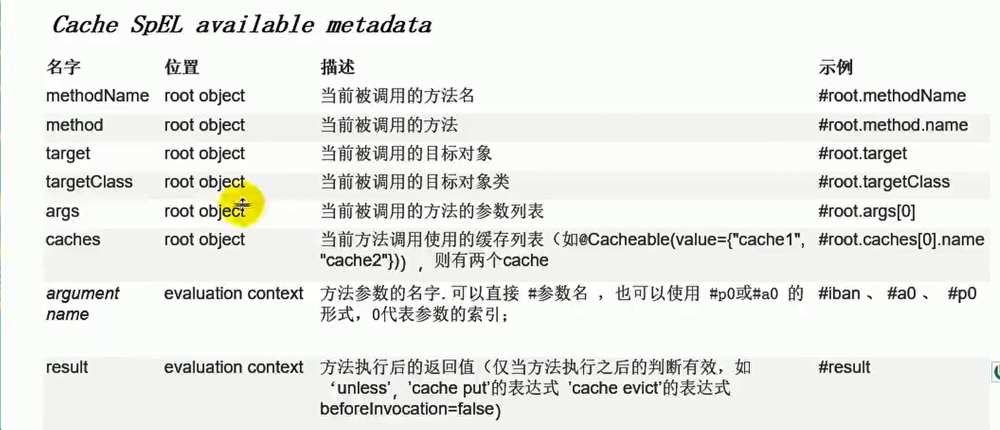


## 用法:

1. 引入缓存依赖:

   ```xml
    		<dependency>
               <groupId>org.springframework.boot</groupId>
               <artifactId>spring-boot-starter-cache</artifactId>
           </dependency>
   ```

2. 开启基于注解的缓存方式:

   `@EnableCaching`

3. 使用缓存:

   @Cacheable:
   
   ```java
    //当参数的id大于0的时候缓存才生效, 如果第一个参数的值等于2缓存不生效
       @Cacheable(/*cacheNames = {"emp"},*/ /*key = "#root.methodName+'['+#id+']'"*/ /*keyGenerator = "myKeyGenerator", *//*condition = "#id > 0", unless = "#a0 == 2"*/)
       public Employee getEmp(Integer id) {
           System.out.println("查询" + id + "号员工");
           Employee emp = employeeMappper.getEmpById(id);
           return emp;
    }
   ```
   
   @CachePut:

```java
@CachePut(/*value = "emp", */key = "#employee.id")
public Employee updateEmp(Employee employee) {
    employeeMappper.updateEmp(employee);
    System.out.println("updateEmp:" + employee);
    return employee;
}
```

​	@CacheEvit:

```java
@CacheEvict(/*value = "emp", */key = "#id")
public void deleteEmp(Integer id){
    employeeMappper.deleteEmpById(id);
}
```

@Caching:

```java
   //定义复杂的缓存规则
    @Caching(
            cacheable = {@Cacheable(/*value = "emp", */key = "#lastName")},
            put = {
                    @CachePut(/*value = {"emp"},*/ key = "#result.id"),
                    @CachePut(/*value = "emp",*/ key = "#result.email")
            }
    )
    public Employee getEmployeeByLastName(String lastName){
        return employeeMappper.getEmpByLastName(lastName);
    }


}
```

在上述过程中的value或者cacheNames如果嫌麻烦, 也可以统一在类上注明这个类统一使用哪个缓存, 以后就不用在方法中指定缓存的名字了:

```java
//可以在类的名字上加上缓存的配置, 抽取公共的缓存部分
@CacheConfig(cacheNames="emp")
@Service
public class EmployeeService {
```

---


## 原理

@Cacheable:

```java
	/*
     * 将方法的运行结果进行缓存, 以后再要相同的数据, 直接从缓存中获取, 不用调用方法
     *
     * CacheManager管理多个Cache组件, 对缓存真正的CRUD操作在Cache组件中, 每一个缓存组件都有自己的唯一一个名字
     * 几个属性:
     *   cacheNames/value: 指定缓存组件的名字; 将方法的返回结果放在哪个缓存中, 是数组的方式, 可以指定多个缓存!
     *   key: 缓存数据使用的key, 可以用它来指定, 默认是使用方法参数的值
     *       编写SpEL: #id; 参数id的值   #a0  #p0  #root.args[0]都是表示方法的第一个参数的值
     *           getEmp[2]
     *   keyGenerator: key的生成器, 可以自己指定key的生成器的组件id
     *       key/keyGenerator: 二选一使用
     *   CacheManager: 指定缓存管理器, 或者cacheResolver指定获取解析器
     *
     *   condition: 指定符合条件下的情况下才缓存, 例如: condition="#id>0"
     *
     *   unless: 否定缓存, 当cunless指定的条件为true, 方法的返回值就不会被缓存, 可以获取到结果进行判断
     *       unless="#result==null"
     *
     *   sync: 是否异步? 异步模式的时候unless不支持
     * */


    /*
    * 原理:
    *   1. 自动配置原理:CacheAutoConfiguration
    *   2. 缓存的配置类:
    *   0 = "org.springframework.boot.autoconfigure.cache.GenericCacheConfiguration"
        1 = "org.springframework.boot.autoconfigure.cache.JCacheCacheConfiguration"
        2 = "org.springframework.boot.autoconfigure.cache.EhCacheCacheConfiguration"
        3 = "org.springframework.boot.autoconfigure.cache.HazelcastCacheConfiguration"
        4 = "org.springframework.boot.autoconfigure.cache.InfinispanCacheConfiguration"
        5 = "org.springframework.boot.autoconfigure.cache.CouchbaseCacheConfiguration"
        6 = "org.springframework.boot.autoconfigure.cache.RedisCacheConfiguration"
        7 = "org.springframework.boot.autoconfigure.cache.CaffeineCacheConfiguration"
        8 = "org.springframework.boot.autoconfigure.cache.SimpleCacheConfiguration"[默认开启]
        9 = "org.springframework.boot.autoconfigure.cache.NoOpCacheConfiguration"
            可以使用debug=true查看哪个缓存配置生效

         * 3. 那个默认配置类生效? SimpleCacheConfiguration
         * 4. 给容器中注册了一个CacheManager: ConcurrentMapCacheManager
         * 5. 可以获取和创建ConcurrentMapCache类型的缓存组件; 他的作用将数据保存在ConcurrentMap中
         *
         *  运行流程:
         *  @cacheable:
         *      1. 方法运行之前, 先去查询Cache(缓存组件), 按照cacheNames指定的名字获取;
         *          (CachManager先获取对应的缓存), 第一次获取缓存如果没有cache组件会自动创建.
         *      2. 去cache中查找缓存的内容, 使用一个key, 默认就是方法的参数;
         *              key是按照某种策略生成的, 默认是使用keyGenerator生成的, 默认使用SimpleKeyGenerator生成key
         *      3. 没有查到缓存就调用目标方法
         *      4. 目标方法返回的结果放进缓存中
         *
         *
         *      @Cacheable标注的方法执行之前先来检查缓存中有没有这个数据, 默认按照参数的值作为key去查询查询缓存
         *       如果没有就运行方法, 并将返回结果放进缓存
         *
         *  核心:
         *      1. 使用CacheManager[ConcurrentMapCacheManager]按照名字得到Cache[ConcurrentMapCache]组件
         *      2. key使用keyGenerator生成的, 默认是SimpleKeyGenerator
         *
         *
         *
         * */
```

@CachePut:

```java
/*
 * @CachePut: 既调用方法, 又更新缓存数据
 * 修改了数据库的某个数据, 同时更新缓存
 * 运行时机:
 *      1. 先调用目标方法
 *      2. 将目标方法的结果缓存起来
 *
 * 测试步骤:
 *      1. 查询1号员工, 查到的结果会放到缓存钟
            key:1  value: lastName: zhangsan
 *      2.以后查询还是之前的结果
 *      3. 更新1号员工: [LastName: zhangsan, gender: 0]
 *              将方法的返回值也放进缓存了.
 *              key: 传入的employee对象  value: 返回的employee对象
 *      4. 查询1号员工?
 *              应该是更新之后的员工, :
 *                  key="#employee.id": 使用传入的参数的员工的id
 *                  key="#result.id": 使用返回值的id
 *                  @Cacheable的key不能使用#result, 因为在没有返回之前就要使用key来查对应的返回结果
 *      注意: 是否有自己的键的生成话策略, 否则也会更新缓存不成功
 * 总结: 在使用@CachePut的时候, 不仅要指定缓存的名字, 还要指定缓存的key, 已确保能够正确的更新缓存
 * */
/*
* 更新缓存的原则:  跟新缓存应注意缓存的名字和缓存使用的的key都要跟要更新的缓存一样才能达到更新缓存的效果
* */
```

@CacheEvit:

```java
/*
* @CacheEvict: 清除缓存
*  key: 指定要清除的数据
*   allEntries:默认是false, 是否要删除掉所有缓存
*   beforeInvocation: 缓存的清除是否在方法执行之前, 默认是false
*       默认代表缓存清除操作是在方法执之后执行; 如果出现异常缓存就不会被清除
*       如果是true, 则无论如何都会清除缓存
* */
```

## 键的生成策略

实现KeyGenerator或者其子类, 并且添加到容器中(key和keyGenerator二选一):

```java
@Configuration
public class MyCacheConfig {
    @Bean(name = "myKeyGenerator")
    public KeyGenerator myKeyGenerator() {
        return new KeyGenerator() {
            /**
             * @param o 目标类
             * @param method 目标方法
             * @param objects 目标方法参数
             * @return 返回的值作为键
             */
            @Override
            public Object generate(Object o, Method method, Object... objects) {
                return method.getName() + "[" + Arrays.asList(objects).toString() + "]";
            }
        };

    }
}
```


## redis的基本使用

1. 常见的五大数据类型:

   ```java
   /*
    * Redis常见的五大数据类型
    *   String, List, Set, Hash, ZSet(有序集合)
    *   stringRedisTemplate.opsForValue()//操作String的
    *   stringRedisTemplate.opsForList()//操作List的
    *   stringRedisTemplate.opsForSet()//操作Set的
    *   stringRedisTemplate.opsForHash()//操作Hash散列的
    *   stringRedisTemplate.opsForZSet()//操作ZSet有序集合
    * */
   ```

2. 保存对象的时候默认使用的是jdk的序列化机制, 保存的对象要实现序列化接口:

   ```java
   public class Employee implements Serializable {...}
   ```

   ```java
   @Test
   public void test02(){
       //默认如果保存对象, 使用jdk序列化机制, 序列化后的数据保存到redis中
       /*
       *  redisTemplate.opsForValue().set("emp-01", emp);
       * 1. 将数据以json的方式保存的两种方法:
       *       1). 自己将对象转为json
       *       2). RedisTemplate默认的序列化规则, 改变默认的序列化规则即可;
       *
       * */
       Employee emp = employeeMappper.getEmpById(2);
       redisTemplate.opsForValue().set("emp-1", emp);
   }
   ```

   

   ## 自定义redis的序列化器

   RedisTemplate中设置默认的序列化器即可:  

   ==template.setDefaultSerializer(new Jackson2JsonRedisSerializer<Employee>(Employee.class));==

   ```java
   @Bean
   public RedisTemplate<Object, Employee> redisTemplate(RedisConnectionFactory redisConnectionFactory)
           throws UnknownHostException {
       RedisTemplate<Object, Employee> template = new RedisTemplate<Object, Employee>();
       template.setConnectionFactory(redisConnectionFactory);
       template.setDefaultSerializer(new Jackson2JsonRedisSerializer<Employee>(Employee.class));
       return template;
   }
   ```

   

# redis缓存

引入了redis, RedisCacheManager就起作用了, **没有引入redis之前, 默认使用的是ConcurrentMapCacheManager==ConcurrenMapCache;将数据保存在ConcurrentMap<Object, Object>**

**引入了redis之后容器中保存的是RedisCacheManager==RedisCache,RedisCache来通过操作Redis来存储数据**

**默认保存数据k-v都是Object; 利用序列化保存**


==自定义redis缓存的序列化器:==

1. 配置 序列化器(jackson2JsonRedisSerializer)
2. 在RedisCacheConfiguration中设置序列化器(jackson2JsonRedisSerializer)

```java
/*
* 自定义缓存的序列化机制
* */
//容器会自动检测到这个CacheManager,并替换原来自带的CacheManager
@Primary //若配置多个缓存管理器需要有一个默认的缓存管理器
@Bean
public RedisCacheManager myCacheManager(RedisConnectionFactory redisConnectionFactory){
    RedisSerializer<String> redisSerializer = new StringRedisSerializer();
    //.entryTtl(Duration.ofHours(1)); // 设置缓存有效期一小时
    Jackson2JsonRedisSerializer jackson2JsonRedisSerializer = new Jackson2JsonRedisSerializer(Object.class);

    ObjectMapper om = new ObjectMapper();
    om.setVisibility(PropertyAccessor.ALL, JsonAutoDetect.Visibility.ANY);
    om.enableDefaultTyping(ObjectMapper.DefaultTyping.NON_FINAL);
    jackson2JsonRedisSerializer.setObjectMapper(om);

    // 配置序列化（解决乱码的问题）
    RedisCacheConfiguration config = RedisCacheConfiguration.defaultCacheConfig()
            .serializeKeysWith(RedisSerializationContext.SerializationPair.fromSerializer(redisSerializer))
            .serializeValuesWith(RedisSerializationContext.SerializationPair.fromSerializer(jackson2JsonRedisSerializer))
            .disableCachingNullValues();

    RedisCacheManager cacheManager = RedisCacheManager.builder(redisConnectionFactory)
            .cacheDefaults(config)
            .build();
    return cacheManager;
}
```

## redis缓存的使用

注解方式跟上述缓存的用法一样

编码方式来操作缓存:

```java
@Autowired
CacheManager cacheManager;

    public Department getDeptById(Integer id) {
        Department department = departmentMapper.getDeptById(id);
        //代码的方式添加缓存获取某个缓存
        //使用缓存管理器得到缓存, 进行api调用
        Cache cache = cacheManager.getCache("dept");
        cache.put("key", department);
        return department;
    }
```

---


---


# springboot与任务


## 异步任务

1. 开启异步注解:==@EnableAsync==

```java
@EnableAsync//开始异步注解功能
@Configuration
public class Xxx{..}
```

2. 使用异步注解: ==@Async==

```java
@Service
public class AsyncService {
    @Async//告诉spring这是一个异步方法, 这个注解起作用, 必须开始@EnableAsync
    public void hello() {
        try {
            Thread.sleep(3000);
        } catch (InterruptedException e) {
            e.printStackTrace();
        }
        System.out.println("处理数据中.....");
    }

}
```

对于上述代码, springboot会==对标注了@Async的方法开启一个线程==


## 定时任务

==**使用定时任务的类一定是容器中的bean**==

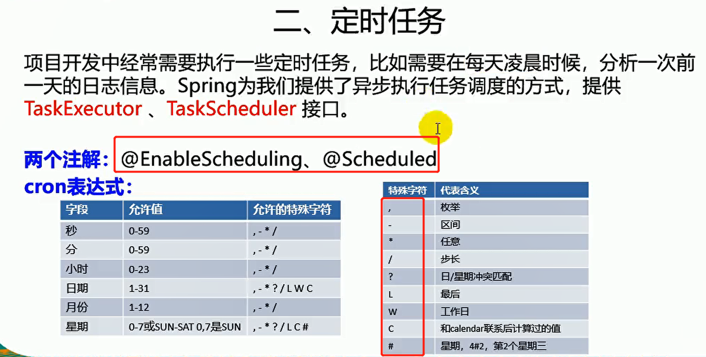


使用:

1. 开启基于注解的定时任务:

```java
@EnableScheduling//开始定时任务功能
@Configuration
public class Xxx {...}
```

2. 使用注解:

```java
@Service
public class ScheduledService {

    /*
    * second, minute, hour, day of month, month, and day of week.
    * 0 * * * * MON-FRI
    * [0 0/5 14,18 * * ?]每天14点整, 和18点整, 每隔5分钟执行一次
    * [0 15 10 ? * 1-6]每个月的周一到周六10:15分执行一次
    * [0 0 2 ? * 6L]每个月的最后一个周六凌晨两点执行一次
    * [0 0 2 LW * ?]每个月的最后一个工作日凌晨狼点执行一次
    * [0 0 2-4 ? * 1#2]每个月的第二个周一凌晨两点到四点期间, 每个整点都执行一次
    * */
//    必须得提前开启定时任务功能
    @Scheduled(cron = "0 * * * * MON-SAT")
    public void hello(){
        System.out.println("hello....");

    }
}
```

---


## 邮件任务

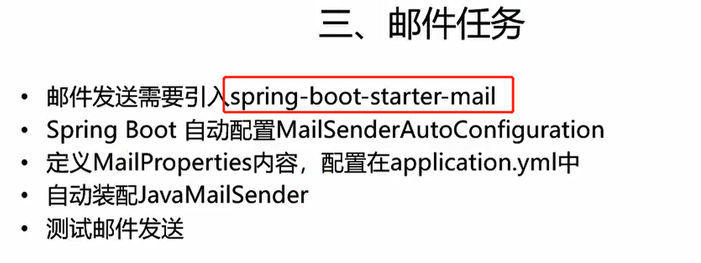


邮件发送的流程:

邮件的发送时邮箱服务器之间的通信, 张三要给李四发送邮件, 应该要发送到自己的邮箱服务器上, 再通过各自的服务器发送到客户端中:

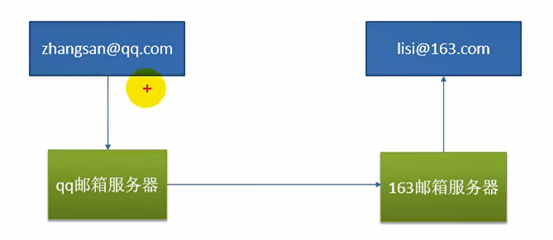


使用:

1. 配置邮箱信息:

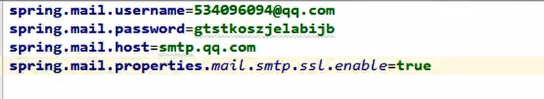

2. 发送简单邮件:

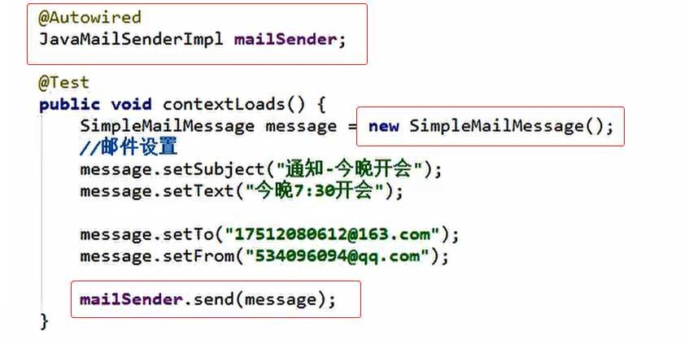

3. 发送复杂邮件:

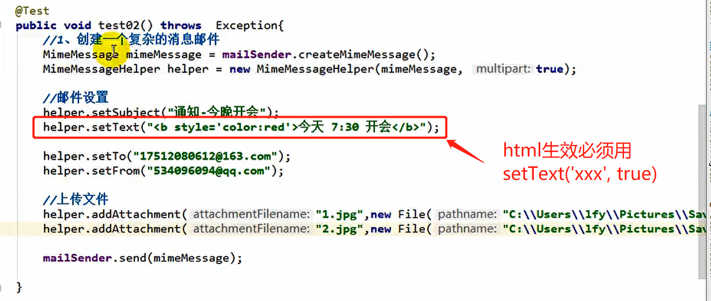


---


# 高级消息

概念:

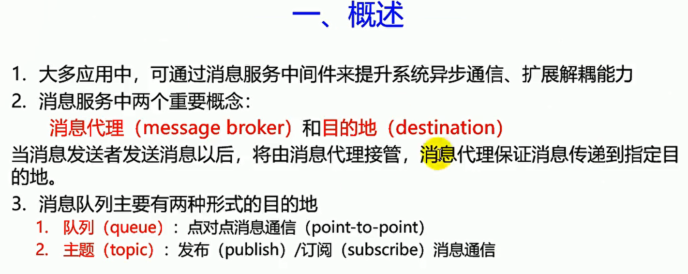


消息代理: 消息中间件的服务器                                                目的地有两种方式: 队列, 主题

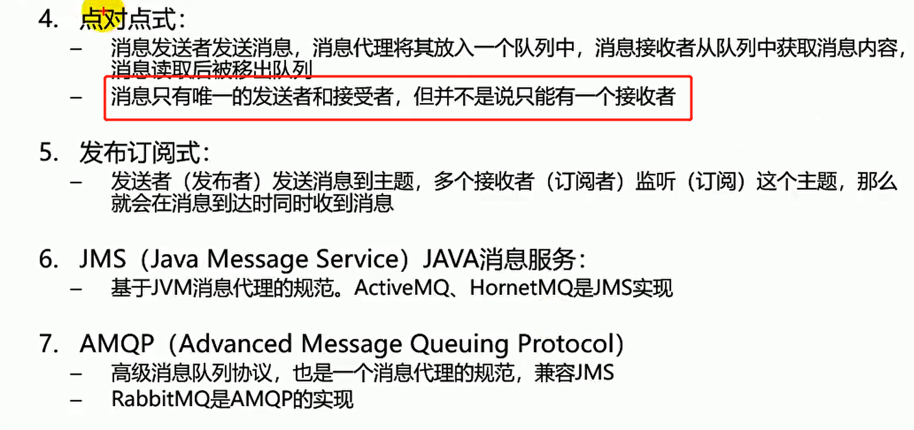


jms 和 amqp 两者之间的对比:

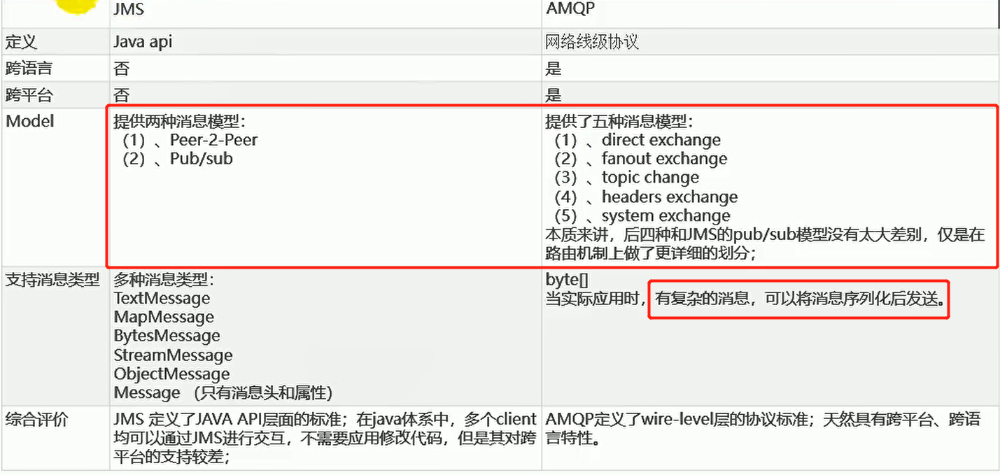


## spring对jms和qmqp的支持:

1. ==**spring-jms提供了对jms的支持**==
2. ==**spring-rabbit提供了对qmqp的支持**==
3. ==**需要ConnectionFactory的实现来连接消息代理(消息代理服务器)**==
4. ==**提供JmsTemplate, RabbitTemplate来发送消息**==
5. ==**@JmsListener(JMS), @RabbitListener(AMQP)注解在方法上监听消息代理发布的消息**==
6. ==**@EnableJms, @EnableRabbit开启支持**==


具体的自动配置: 

1. JmsAutoConfiguration
2. RabbitAutoConfiguration


## RabbitMQ

简介:

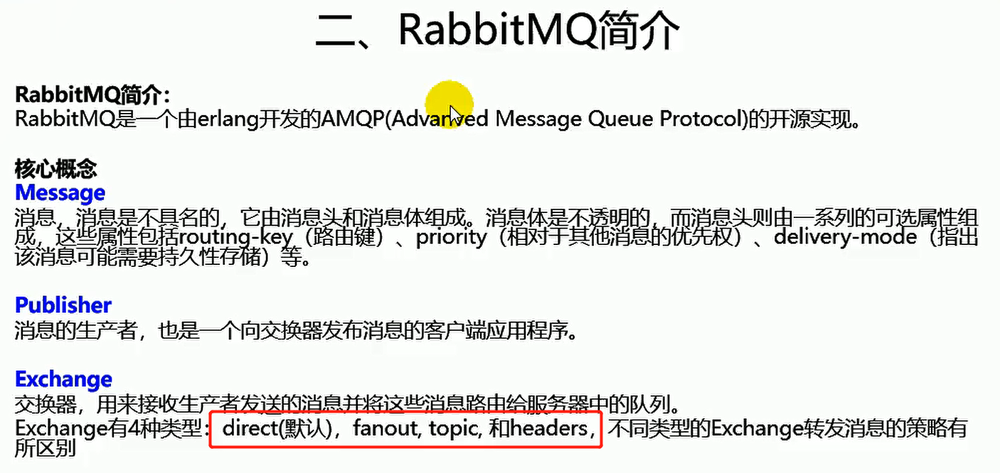

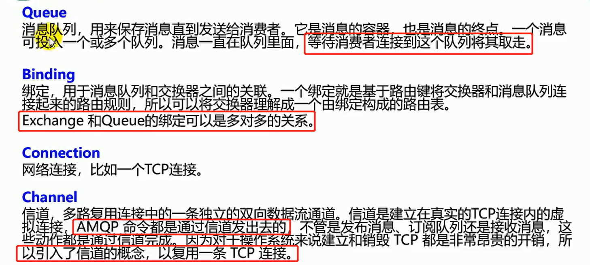

Virtual Host: 消息服务器里面有很多虚拟主机, 每一个虚拟主机都是一个mini版的消息服务器, **连接消息服务器必须先连接虚拟主机, 默认是/**

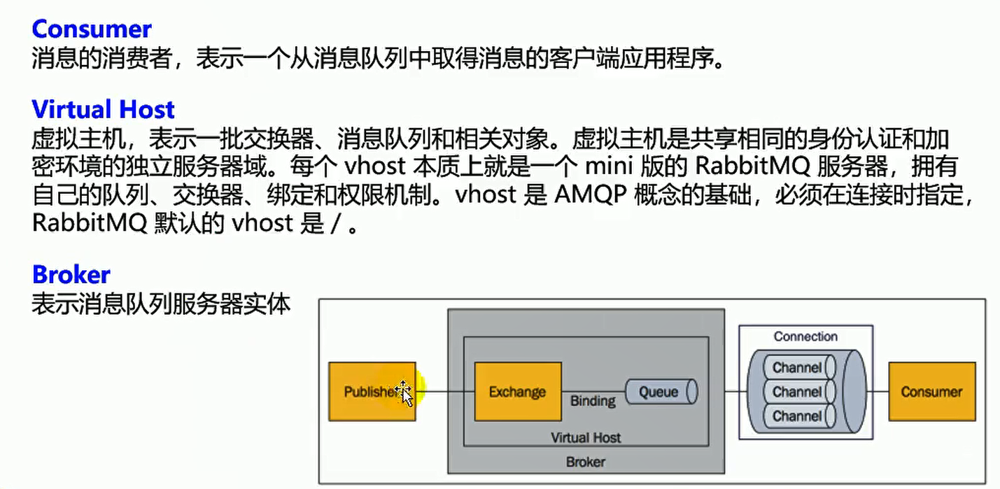


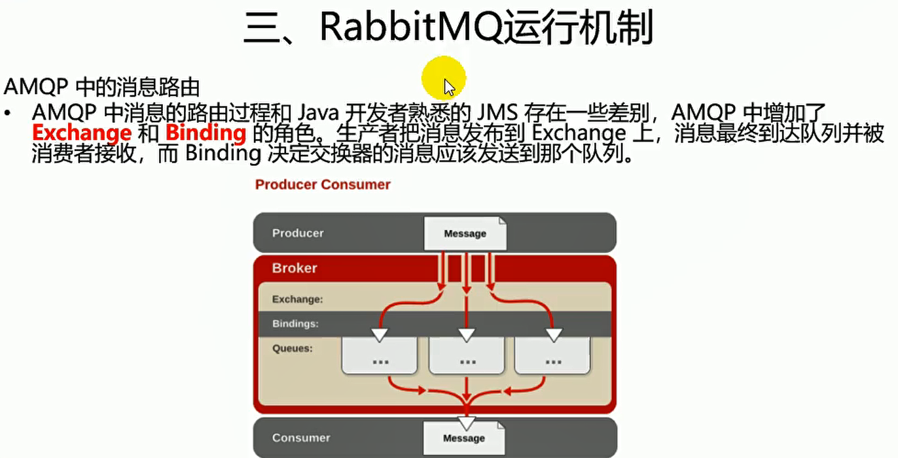

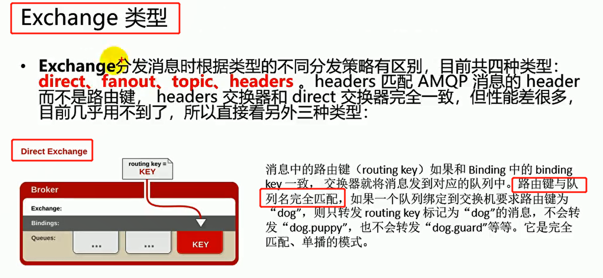

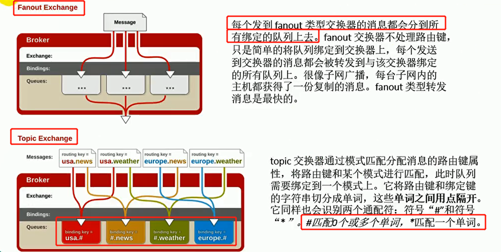


自动配置:

```java
/*
* 自动配置:
*       1. RabbitAutoConfiguration
*       2. 有自动配置了连接工厂ConnectionFactory
*       3. RabbitProperties封装了RabbtiMQ的配置
*       4. RabbitTemplate: 给rabbitMQ发送和接收消息的
*       5. AmqpAdmin: RabbitMQ系统管理组件, 可以创建和销毁交换器或者队列
*       6. @EnableRabbit + @RabbitListener
* */
```


简单使用:

1. 配置rabbitmq信息:   端口号默认是5672(ssl是5671)  , virtual Host默认是/

```java
spring.rabbitmq.host=localhost
spring.rabbitmq.username=guest
spring.rabbitmq.password=guest
spring.rabbitmq.virtual-host=/
```

2. 开启基于注解的RabbitMQ模式: ==**@EnableRabbit**==
3. 使用注解:   @RabbitListener(queues = "xxx")

```java
@Service
public class BookService {
    @RabbitListener(queues = "atguigu.emps")
    public void receive(Book book) {
        System.out.println("收到消息" + book);
    }

    //不需要反序列化, 直接监听完整的消息:(Message)
    @RabbitListener(queues = "atguigu")
    public void receive02(Message message) {
        System.out.println(message.getBody());
        //消息头信息
        System.out.println(message.getMessageProperties());
    }
}
```

**自己定义序列化规则:**

```java
@Configuration
public class MyAMQPConfig {
    //两种方式解决序列化问题:

//1.
    @Bean
    public MessageConverter messageConverter(){
       return new Jackson2JsonMessageConverter();
    }


   //2.
   /* @Bean
    public RabbitTemplate rabbitTemplate(RabbitTemplateConfigurer configurer, ConnectionFactory connectionFactory) {
        RabbitTemplate template = new RabbitTemplate();
        template.setMessageConverter(new Jackson2JsonMessageConverter());
        configurer.configure(template, connectionFactory);
        return template;
    }*/
}
```


**基于代码的方式来发送, 接收, 创建消息:**

```java
@Autowired
RabbitTemplate rabbitTemplate;//发送和接收消息

@Autowired
AmqpAdmin amqpAdmin;//创建和管理rabbit组件

 //点播模式
    @Test
    void putMassage() {
        //message需要自己构建一个, 定义消息体内容和消息头
        //rabbitTemplate.send(exchange, routKey, message);

        //object默认当成消息体, 只需要传入要发送的对象, 自动序列化发送给rabbitMQ;
        //rabbitTemplate.convertAndSend(exchange, routKey, Object);

        HashMap<Object, Object> map = new HashMap<>();
        map.put("msg", "这是第一个消息");
        map.put("data", Arrays.asList("helloworld", 123, true));
        //对象被默认序列化之后发送出去
        rabbitTemplate.convertAndSend("exchange.direct", "atguigu", new Book("西游记", "吴承恩"));
    }

    @Test
    //接收数据, 如何将数据转为json发送出去?
    public void receive(){
        Object o = rabbitTemplate.receiveAndConvert("atguigu.news");//队列的名字
        System.out.println(o.getClass());
        System.out.println(o);
    }


    //广播模式
    @Test
    public void sendMsg(){
        rabbitTemplate.convertAndSend("exchange.fanout", "", new Book("三国演义", "罗贯中"));

    }

    @Test
    public void createExchange(){
        //创建一个交换器
        amqpAdmin.declareExchange(new DirectExchange("amqpadmin.exchange"));
        System.out.println("创建完成");

        //创建一个队列
        amqpAdmin.declareQueue(new Queue("amqpadmin.queue", true));//队列是否持久化

        //创建绑定规则: 绑定可以是交换器和交换器绑定, 也可以是交换器和队列进行绑定
        amqpAdmin.declareBinding(new Binding("amqpadmin.queue", Binding.DestinationType.QUEUE,"amqpadmin.exchange","amqpadmin.routingKey",null ));


    }
```


---


# springboot与检索

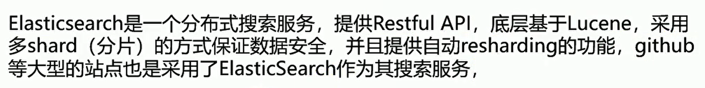

Elasticsearch几个重要的概念:    ==**索引, 类型, 文档 属性**==

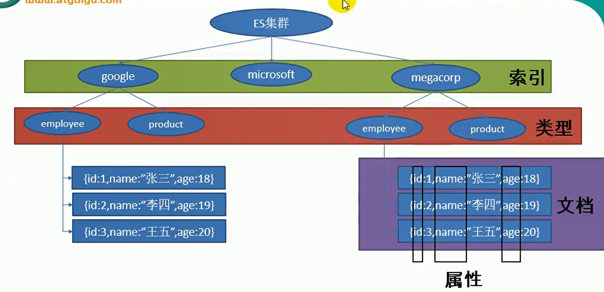

**存储员工restful风格示例:**  

==请求类型:     put存储, get获取(/megacorp/employee/1), delete删除, head:检查是否有这条文档, 如果有则相应状态码为200, 如果需要更新已存在的文档, 则只需要再次put, 更新的时候版本会叠加==

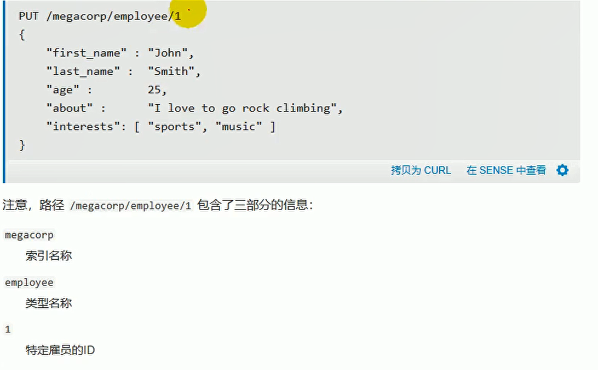

---

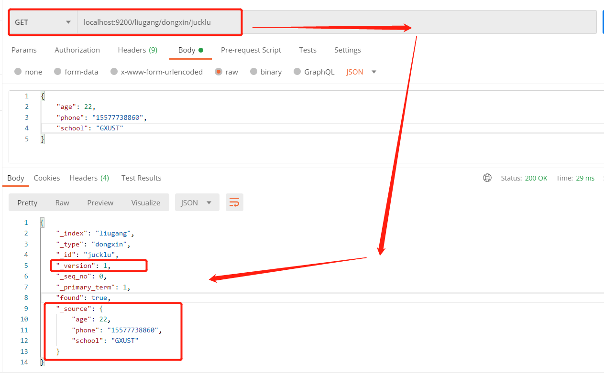

---


高级搜索查询:

==上述使用了文档的id标识来搜索文档, 高级搜索可以用_search来替换文档id标识, 然后附带搜索参数?q来进行高级检索:==


上述搜索last_name为Smith的文档


==也可以在请求体中的json来指定查询规则:==

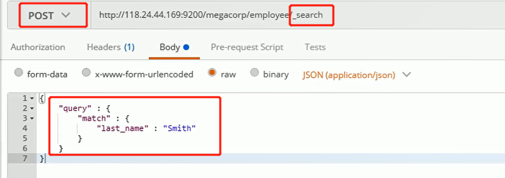

上述的查询达到的效果是一样的


甚至会在json中定义更为复杂的查询表达式:(只要查询到的结果年龄大于30的文档, ==**filter: 条件为true时才返回) must match为精确匹配, 只能等于, 不能是包含关系**==

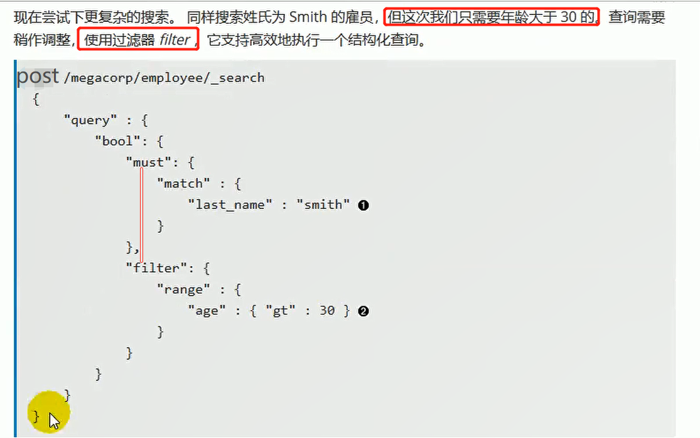


---


没有精确匹配(must)的时候就会用包含(拆分)关系来查找:

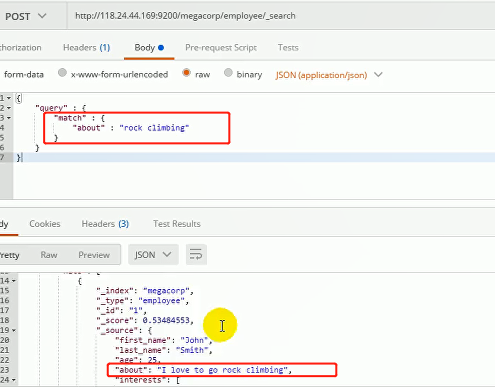

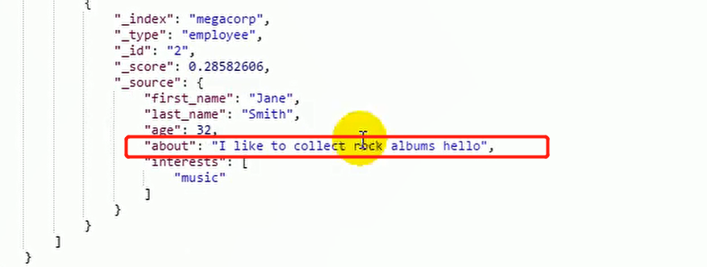


---


把"rock climbing"当成一个单词来搜索:(必须得要完整的出现)

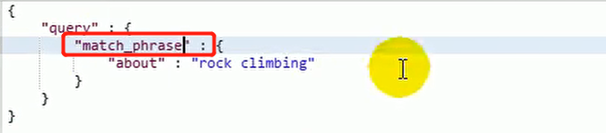

查找结果:


---


高亮搜索:

搜索出来后对about字段进行高亮显示:

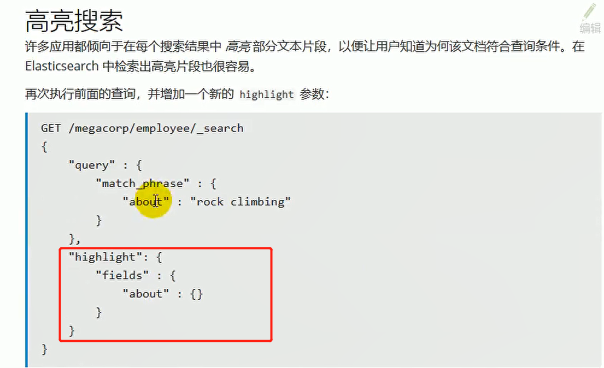

查询到的结果: 可以获取直接渲染在html页面上

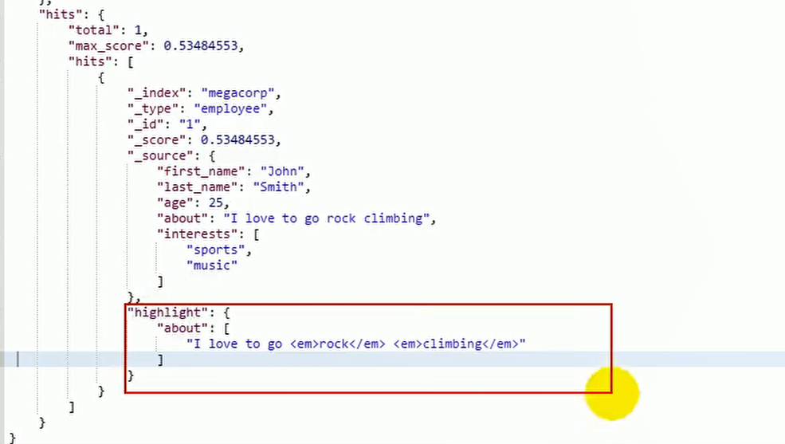


---


==**上述总结:**==

==**match之前:**==

1. ==**must: 精确匹配, 只能完全相等, 不能多也不能少**==
2. ==**没有指定则按照空格拆分单词进行查找**==
3. ==**match_phrase: 规定为一个单词来进行查找, 有空格也不能拆分**==


==**highlight -->  fields --> xxx:  对查询之后xxx字段高亮显示**==

---


springboot的两种技术和es(elasticsearch)交互:

```java
/*
* springboot默认支持两种技术和es交互
*   1. jest(默认不生效)
*        需要导入的工具包(io.searchbox.client.JestClient)
*   2. SpringData Elasticsearch操作es[es版本有可能不合适]
*           如果版本不适配, 可以升级springboot版本或者安装对应版本的es
*           1). Client节点信息clusternodes; clusterName
*           2).ElasticsearchTemplate操作es
*           3). 编写一个ElasticsearchRepository的子接口来操作es
*
* */
```

**如果要用jest操作es则引入jest的依赖, 如果要用springdata elasticsearch来跟es交互则需要引入springdata elasticsearch依赖**


## 简单使用:


方式一: jest方式与es交互:

1. 引入jest依赖:

```xml
<!--对用着es的版本来引入jest-->
<!-- https://mvnrepository.com/artifact/io.searchbox/jest -->
<dependency>
    <groupId>io.searchbox</groupId>
    <artifactId>jest</artifactId>
    <version>6.3.1</version>
</dependency>
```

2. 配置jest的uris:

`spring.elasticsearch.jest.uris=localhost:9200`

3. 使用@JestId来标记要保存文档的主键:

```java
public class Article {

    @JestId
    private Integer id;
    private String author;
    private String title;
    private String content;
    ...
}
```

4. 使用JestClient来保存文档:

```java
@Autowired
JestClient jestClient;

@Test
void contextLoads() {
    //1. 给es索引(保存)一个文档
    Article article = new Article();
    article.setId(1);
    article.setTitle("好消息");
    article.setAuthor("zhangsan");
    article.setContent("hello world");

    //构建一个索引
    Index index = new Index.Builder(article).index("atguigu").type("news").build();
   try {
       jestClient.execute(index);

   }catch (Exception e){
       e.printStackTrace();

   }
```

5. 使用jestClient来搜索文档:

```java
//测试搜索
@Test
public void search(){
    //查询表达式
    String json = "{

   'query':{

​            'match':{

​                   'last_name': 'Smith'							

​              }

   }

}";
    //构建搜索功能
    Search search = new Search.Builder(json).addIndex("atguigu").addType("news").build();

    try {
        SearchResult searchResult = jestClient.execute(search);
        System.out.println(searchResult.getJsonString());
    }catch (IOException e){
        e.printStackTrace();
    }
}
```


方式二: spring Data的方式来操作es:

1. 引入spring-boot-starter-data-elasticsearch的依赖:

```xml
<dependency>
    <groupId>org.springframework.boot</groupId>
    <artifactId>spring-boot-starter-data-elasticsearch</artifactId>
</dependency>
```

2. 配置信息:

```xml
spring.data.elasticsearch.cluster-name=elasticsearch
spring.data.elasticsearch.cluster-nodes=localhost:9300
```

3. 给要存储的实体类使用==**@Document**==标注上文档信息: **所需要存储到的索引的名字inidexName  和类型 indexStoreType:**

```java
@Document(indexName = "atguigu", indexStoreType = "book")
public class Book {
    private Integer id;
    private String bookName;
    private String author;
 ...
}
```

4. ==**继承ElasticsearchRepository**==

```java
public interface BookRepository extends ElasticsearchRepository<Book,Integer> {

    //自己扩展方法, 不用写实现, 方法命令按照spring的约定, 然后就可以直接使用这个方法了
    //具体命名规范可以查看spring官方文档
    public List<Book> findByBookNameLike(String bookName);
}
```

5. 使用相关的repository:

```
@Autowired
BookRepository bookRepository;

 @Test
    public void testElasticsearchRepository() {
        //Book book = new Book(1, "西游记", "吴承恩");
        //bookRepository.save(book);

      for (Book findBook: bookRepository.findByBookNameLike("游")){
          System.out.println(findBook);
        }

    }
```